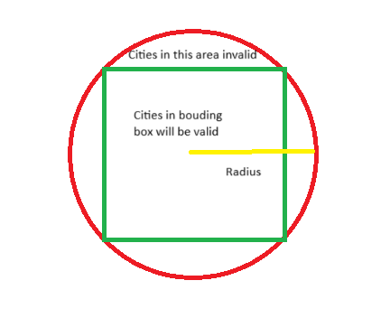

Introduction
============
This is introduction how to setup this project

## Prerequisite
- Python3 (pip)
- Git
- Redis / or Docker


## Setup project environment
Clone this repository
```
$ git clone 
```
Move to 3rd Party API Usage folder `3rd Party API Usage`
Init virtual environment and activate 
```
$ pip install virtualenv
$ python -m virtualenv env
$ source env/Scripts/activate
```

Install all dependencies and module
```
$ pip install -r requirements.txt
``` 

## Setup REDIS database
There are many way to set up REDIS the database
- Docker
```
$ docker run -p 6379:6379 -it redis/redis-stack:latest
```
- Local database (https://redis.io/downloads/)
- Cloud database (you can get free redis database at https://cloud.redis.io/)

## Setup database config
At 3rd Party API Usage folder, create `.env` file, add database config to file with format
```
API_KEY=your_api_key
REDIS_PORT=your_redis_port
REDIS_HOST=your_redis_host
REDIS_DB=your_redis_db
REDIS_PASSWORD=your_redis_password
```

## Obtain and use OpenWeather API key
- Open https://openweathermap.org/ and create an account
- Go to https://home.openweathermap.org/api_keys to get API key (active after couple hours)
- After API key active, go to .env file and add field
```
API_KEY=your_api_key
```

- Now, your .env file will be look like this
```
REDIS_PORT=your_redis_port
REDIS_HOST=your_redis_host
REDIS_DB=your_redis_db
REDIS_PASSWORD=your_redis_password
API_KEY=your_api_key
```


## Run project

Launch server on port 5000
```
$ python script.py
```

Wait couple minutes to server start successfully
Go to localhost:5000

## Explain my optimization approach
- First I stored all city data on Redis DB to cache (include city id, longitude, latitude), this will take a little bit time when server start but then we can get these static data faster, also Redis support GEO data, this will help us find location by Geo radius
- My logic when I get cities in a bounding box is: get center position of a bounding box, find a suitable radius number, by center and radius we can query Redis to get all location in this area; later, filter the positions outside the bounding box
- Call API to get the weather for each city by id in launching parallel tasks 
- TODO: If the bounding box has too much difference in length and width, we can divide the bounding box into many smaller bounding boxes with less difference. This reduces the number of cities within the radius but outside the bounding box!
- TODO: add an service receive all failed request and handle it


